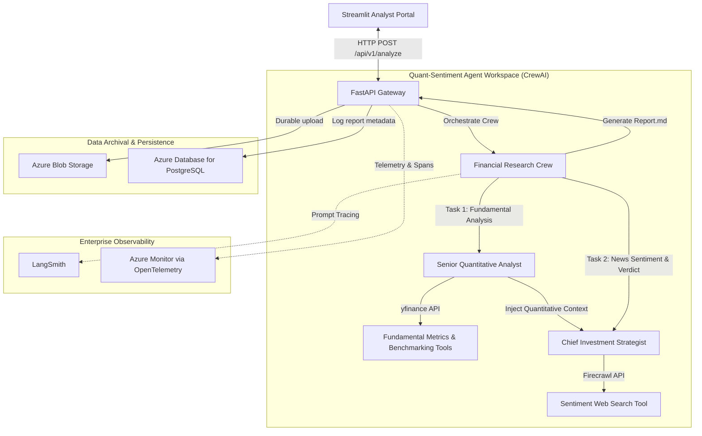

# Autonomous Quantitative Investment Research & Equity Synthesis Engine

An autonomous, production-grade financial analysis platform that acts as a self-contained equity research desk. Using a multi-agent orchestration pattern built on **CrewAI**, **FastAPI**, and **Streamlit**, the engine automatically aggregates financial statements, conducts quantitative performance benchmarking against market indices, scrapes qualitative news sentiment, and synthesizes investment recommendations (BUY, SELL, or HOLD). All artifacts are durably archived in **Azure Blob Storage** and logged in **Azure Database for PostgreSQL**.

---

## Technical Architecture & Request Flow

The diagram below outlines how a user request flows through the frontend, API gateway, agent reasoning workspace, and cloud storage systems:



### Execution Flow:
1. **User Request**: The research analyst inputs a stock ticker (e.g., `AMZN`) into the [Streamlit Portal](file:///Users/panavjogi/Downloads/AAFA/crewai-agent-azure/frontend/app.py). Streamlit sends an HTTP POST request containing the ticker to the FastAPI endpoint [/api/v1/analyze](file:///Users/panavjogi/Downloads/AAFA/crewai-agent-azure/src/api/routes.py#L21).
2. **Quantitative Extraction**: The FastAPI controller invokes `run_financial_crew`. The **Quantitative Analyst** agent retrieves current valuation statistics from Yahoo Finance (`yfinance`) and compares the 365-day historical performance against the S&P 500 (`SPY`).
3. **Sentiment Synthesis**: The Quantitative Analyst's output is passed directly into the **Investment Strategist's** task context. The Strategist uses **Firecrawl** to pull the top 3 news articles matching recent search terms, matches the qualitative sentiment with quantitative values, and issues a BUY, SELL, or HOLD verdict.
4. **Cloud Persistence**: The FastAPI gateway uploads the resulting Markdown file to **Azure Blob Storage** and commits a metadata record to **Azure PostgreSQL** using **SQLAlchemy ORM**.
5. **UI Rendering**: The JSON response (containing the report text, execution logs, and Blob URLs) is returned to Streamlit for presentation.

---

## Detailed Directory & File Walkthrough

### 1. Core Services & Entry Points
* [main.py (root)](file:///Users/panavjogi/Downloads/AAFA/crewai-agent-azure/main.py): CLI interface wrapper designed to run, test, and debug the entire ingestion, upload, and database logging pipeline locally without starting the web servers.
* [src/api/main.py](file:///Users/panavjogi/Downloads/AAFA/crewai-agent-azure/src/api/main.py): Sets up the FastAPI application instance, assigns router prefixes (`/api/v1`), handles application configuration, and exposes a `/` root health check endpoint.
* [src/api/routes.py](file:///Users/panavjogi/Downloads/AAFA/crewai-agent-azure/src/api/routes.py): Contains the primary controller logic for [/api/v1/analyze](file:///Users/panavjogi/Downloads/AAFA/crewai-agent-azure/src/api/routes.py#L21). It receives requests, runs the Crew AI workspace, converts execution output to string format, triggers the Azure storage upload, and writes logs to PostgreSQL.
* [src/api/models.py](file:///Users/panavjogi/Downloads/AAFA/crewai-agent-azure/src/api/models.py): Defines request and response validation schemas using Pydantic (`AnalysisRequest`, `AnalysisResponse`) to validate ticker formatting and structure the JSON response payload.

### 2. Multi-Agent Reasoning (CrewAI)
* [src/agents/agents.py](file:///Users/panavjogi/Downloads/AAFA/crewai-agent-azure/src/agents/agents.py): Configures the agent personas (roles, goals, and backstories) and assigns tool permissions:
  * **Senior Quantitative Analyst**: Deals strictly with hard metrics (balance sheets, valuations, returns). Equipped with `FundamentalAnalysisTool` and `CompareStocksTool`.
  * **Chief Investment Strategist**: Focused on qualitative catalysts (sentiment, news headlines, executive shifts). Equipped with `SentimentSearchTool`.
  * *Note*: `allow_delegation=False` is enforced to prevent agents from creating loops or delegating work to each other.
* [src/agents/tasks.py](file:///Users/panavjogi/Downloads/AAFA/crewai-agent-azure/src/agents/tasks.py): Defines the prompt engineering layer of the application. It outlines the specific expectations for each task. The strategist task binds a context dependency `context=[quant_task]`, ensuring the quantitative summary serves as a hard boundary for the strategist's reasoning.
* [src/agents/crew.py](file:///Users/panavjogi/Downloads/AAFA/crewai-agent-azure/src/agents/crew.py): Orchestrates the sequential pipeline execution (`Process.sequential`) and configures tracing triggers (LangSmith).

### 3. Agent Tools
* [src/agents/tools/financial.py](file:///Users/panavjogi/Downloads/AAFA/crewai-agent-azure/src/agents/tools/financial.py):
  * **FundamentalAnalysisTool**: Fetches trailing and forward P/E, PEG, market cap, EPS, beta, and analyst ratings via `yfinance`. It filters the raw JSON object down to 11 key metrics to avoid context window bloat.
  * **CompareStocksTool**: Downloads the closing prices of the target stock and S&P 500 (`SPY`) for the past 365 days and computes relative returns.
* [src/agents/tools/scraper.py](file:///Users/panavjogi/Downloads/AAFA/crewai-agent-azure/src/agents/tools/scraper.py):
  * **SentimentSearchTool**: Uses Firecrawl to execute semantic web searches on news headlines. By requesting search formats in `markdown` and limiting results to the top 3, it fetches clean text while stripping out raw HTML formatting.

### 4. Shared Utilities & Cloud Integration
* [src/shared/config.py](file:///Users/panavjogi/Downloads/AAFA/crewai-agent-azure/src/shared/config.py): Employs Pydantic's `BaseSettings` to parse and validate environmental variables (APIs, DB credentials). Cached using `@lru_cache` to minimize file system reads.
* [src/shared/database.py](file:///Users/panavjogi/Downloads/AAFA/crewai-agent-azure/src/shared/database.py): Initializes the SQLAlchemy database engine, maps the `reports_log` schema via the `FinancialReport` class, handles table creation, and implements safe session transaction management with rollback hooks.
* [src/shared/storage.py](file:///Users/panavjogi/Downloads/AAFA/crewai-agent-azure/src/shared/storage.py): Connects to Azure Blob Storage, checks container existence (`reports`), uploads the local markdown reports, and returns public download URLs.

### 5. Frontend UI Portal
* [frontend/app.py](file:///Users/panavjogi/Downloads/AAFA/crewai-agent-azure/frontend/app.py): Streamlit dashboard acting as the analyst portal. Handles user search input, makes HTTP requests, holds dashboard session states, parses and displays markdown reports, and serves a file-download stream.

---

## Quantitative & Financial Methodology

### 1. Metric Analysis Framework
The system focuses on specific valuation and risk metrics during quantitative extraction:
- **Trailing P/E & Forward P/E**: Used to assess equity valuations based on historical earnings and forecasted income.
- **PEG Ratio (Price/Earnings to Growth)**: Analyzes stock value while accounting for expected earnings growth.
- **Beta (Volatility Metric)**: Measures systematic risk relative to the broader market. A $\beta > 1$ represents higher volatility than the S&P 500; a $\beta < 1$ indicates lower volatility.
- **Trailing EPS**: Establishes a net profitability baseline per outstanding share.

### 2. Relative Benchmark Calculations
To evaluate performance, the comparison engine calculates the absolute return of the asset alongside the S&P 500 tracker (`SPY`) over a rolling 1-year (365-day) period.

$$\text{Asset Return (\%) } = \left( \frac{P_{\text{last}} - P_{\text{first}}}{P_{\text{first}}} \right) \times 100$$

Where:
- $P_{\text{first}}$ is the closing price on the first trading day of the 365-day period.
- $P_{\text{last}}$ is the closing price on the most recent trading day.

---

## Technical Design & Optimization Decisions

1. **Hallucination Mitigation through Strict Context Grounding**:
   LLMs are prone to hallucinating numbers when conducting open-ended analyses. To prevent this, the engine is structured as a sequential pipeline. The Quantitative Analyst first compiles structured numerical tables and comparative index returns. By adding `context=[quant_task]` to the Strategist's task definition in `tasks.py`, the quantitative analyst's output is injected directly into the strategist's context window. This ensures the strategist cannot fabricate performance metrics and must ground its final verdict in the generated financial table.
2. **Context Window and Token Optimization**:
   Querying financial APIs like `yfinance` often returns objects containing hundreds of metadata keys, most of which are irrelevant for fundamental indexing. Similarly, parsing standard news websites returns large amounts of boilerplate HTML code. I optimized token efficiency by:
   - Selecting only 11 core keys in `FundamentalAnalysisTool` before returning data to the agent.
   - Instructing the Firecrawl client to return search results specifically in clean Markdown format and limiting results to the top 3, stripping out layout elements.
3. **Observability and Diagnostic Telemetry**:
   Debugging multi-agent systems is difficult without tracing the execution paths of individual tasks. I integrated OpenTelemetry (`azure-monitor-opentelemetry`) and LangSmith into the core execution pipeline. Every agent kickoff, tool call, and database query is logged as structured trace spans, allowing us to monitor latency and API token utilization.

---

## Installation & Setup

### Prerequisites
- Python 3.12+
- `uv` package manager (recommended: `curl -LsSf https://astral.sh/uv/install.sh | sh`)
- OpenAI API Key
- Firecrawl API Key
- Azure Blob Storage & Azure PostgreSQL connection strings

### 1. Clone & Navigate
```bash
git clone https://github.com/panav-22/Autonomous-Quantitative-Investment-Research-Equity-Synthesis-Engine.git
cd Autonomous-Quantitative-Investment-Research-Equity-Synthesis-Engine
```

### 2. Configure Environment Variables
Create a `.env` file in the root directory:
```env
# AI Brain
OPENAI_API_KEY="your_openai_api_key"
OPENAI_MODEL_NAME="gpt-4o"

# Web Scraping
FIRECRAWL_API_KEY="your_firecrawl_api_key"

# Database Persistence
AZURE_POSTGRES_CONNECTION_STRING="postgresql://[user]:[password]@[host]:5432/[db]?sslmode=require"

# Object Storage
AZURE_BLOB_STORAGE_CONNECTION_STRING="DefaultEndpointsProtocol=https;AccountName=[account];AccountKey=[key];EndpointSuffix=core.windows.net"

# Optional Observability Tracing
LANGCHAIN_TRACING_V2=false
LANGCHAIN_API_KEY="your_langsmith_api_key"
```

---

## Running the Application

To run the complete platform locally, launch the backend FastAPI gateway and the Streamlit frontend in separate terminal windows:

### Terminal 1: Launch Backend API
```bash
uv run uvicorn src.api.main:app --reload
```
Ensure the terminal prints: `Application startup complete` and `Uvicorn running on http://127.0.0.1:8000`.

### Terminal 2: Launch Streamlit Portal
```bash
uv run streamlit run frontend/app.py
```
This opens your browser at `http://localhost:8501`. Enter a stock ticker in the sidebar and click **Run Full Analysis**.
